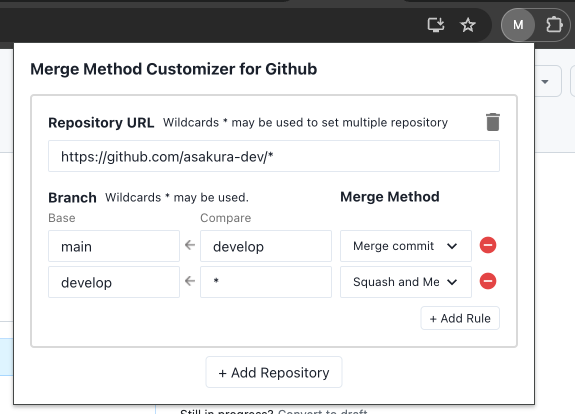

# Merge Method Customizer For Github Chrome Extension

このChrome拡張機能は、GitHubのプルリクエストページで使用するマージ方法のデフォルトをカスタマイズするためのものです。

## 機能
- BaseブランチとCompareブランチの名前に基づいてマージ方法のデフォルト自動的に変更します。
- マージ方法の選択は、ユーザーが設定したルールに基づいて行われます。

## インストール方法
- Releaseから `merge-method-customizer-for-github-chrome-extension.zip` をダウンロードして展開
- chrome://extensions/ を開いてデベロッパーモードを有効化
- `パッケージ化されていない拡張機能を読み込む` でディレクトリを選択

## ライセンス
- MIT License